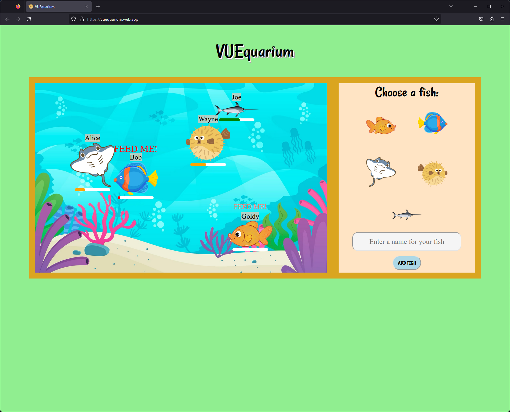

# VUEquarium

Virtual aquarium made with Vue.js (Vue 3 Composition API)

Minimum resolution: 1520x860



## Features
- Fishes swim around the aquarium
- Fishes can be added to the aquarium
- Fishes can be fed
- Fishes can die

## Project setup
```
npm install
npm run dev
```

Deployed on [Firebase](https://vuequarium.web.app/)
